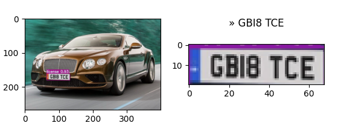
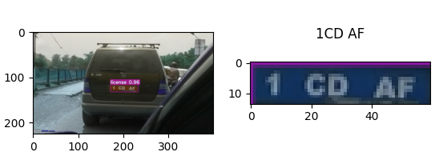
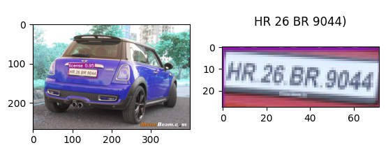

# Automatic number-plate recognition_with_yolov7
This project aims to conduct automatic number-plate recognition by YOLOv7 with OCR.

## Setup the environment
```bash
conda create -n ANPR python=3.8
conda activate ANPR
pip install -r requirements.txt
```

## Train the YOLOv7 model
Run the following command to preprocess the dataset and start transfer learning yolov7 to our application.
```bash
source setup.sh
```

## Run the detection and OCR
You can inference this project by following command. If you try to add your own testing image, please put it into folder "license".
```bash
source detect_ocr.sh
```

or

```bash
cd yolov7
python detect.py --weights ./runs/train/yolov7-license/weights/best.pt --conf 0.25 --img-size 640 --source ../license --save-txt
cd ..
python OCR.py
```

## Result




## The resource used in this project as following:

**YOLOv7**
* Paper : https://arxiv.org/abs/2207.02696
* Code : https://github.com/WongKinYiu/yolov7

**Datasets**
* Car License Plate Detection https://www.kaggle.com/datasets/andrewmvd/car-plate-detection